# Issue #37：公共看板的数据路径与性能分析

调查时间：2026-09-09。读取当前代码、线上 DynamoDB DescribeTable、已批准事件的分页扫描、CloudWatch 最近七天指标，并从当前机器请求公开 API 和打开线上看板。未修改数据库或 #37 业务代码。下文容量使用十进制 KB/MB；接口字节数为解压后的 JSON，不能当作压缩后的网络传输量。

## 主要结论

问题已经不只是性能：`getAllPublicEvents` 忽略 `LastEvaluatedKey`，导致线上看板漏掉第二页已批准事件。当前浏览器显示 376 条事件、124 位贡献用户；完整扫描实际有 443 条已批准事件、145 位贡献用户，少了 67 条事件和 21 位用户。全局统计与图表因此不完整。

当前数据规模很小，不需要先换数据库。优先修复分页完整性、将统计/曲线所需的轻量数据与详情分开、再加入有明确失效规则的公共缓存。仅增加 status 索引或前端无限滚动不足以解决问题。

## 当前读取链路

```mermaid
flowchart LR
  A[PublicDashboard 挂载] --> B[useAsync / getAllEvents]
  B --> C[GET /dev/all-events]
  C --> D[getAllPublicEvents Lambda]
  D --> E[VoiceFemEvents 单次 Scan / status=approved]
  E --> F[按用户 ID 去重]
  F --> G[VoiceFemUsers BatchGet / 每批 100 / 串行]
  G --> H[附加公开姓名 / 剥离附件 / 日期降序]
  H --> I[浏览器分组统计 / 排序 / 绘制全部曲线]
  I --> J[点击用户档案]
  J --> K[GET /dev/user/:id/public]
  K --> L[VoiceFemUsers GetItem]
```



前端没有为这次公共请求提供跨组件缓存或请求去重；`useAsync` 保存当前组件结果，重新挂载会请求。`/all-events` 前端超时上限为 34 秒。切换图表过滤器不重新查询数据库，而是重复处理当前数组。

| 页面功能 | 使用的数据 | 现在从哪里取 |
|---|---|---|
| 总事件数、贡献人数、用户列表和事件类型分布 | userId、userName、type、事件数量 | 首屏全部事件 |
| VFS 对齐曲线、术前术后均值、提升方差 | userId、type、date、details.fundamentalFrequency、手术日期 | 首屏全部事件，在浏览器分组计算 |
| 增强图表和医生筛选 | 上述字段、createdAt、details.doctor/customDoctor/surgeryMethod | 首屏全部事件 |
| 用户档案的事件列表及详情 | 日期、基频、医生、训练内容、感受、备注、formants/pitch/jitter/shimmer/hnr 等 | 从首屏已下载数组筛选 |
| 用户公开名称、简介、社交信息 | profile 的公开字段及隐私开关 | 点击后单独 GetItem |

Lambda 投影了 `userId, eventId, type, date, details, createdAt, attachments`。其中 attachments 读出后又被删除；`details` 整个嵌套对象返回，包括看板并未渲染的 `full_metrics`。用户名查询也取整个 profile，实际只需要 name 和 isNamePublic。

## DynamoDB 线上结构

DescribeTable 与 `infra/template-production.yaml` 一致；三张表均按需计费，无 GSI/LSI。ItemCount 和 TableSizeBytes 是后台更新的近似元数据，已批准事件数量另由本次实际扫描得到。

| 表 | 分区键 | 排序键 | DescribeTable 条数 | 表大小 | 与首屏关系 |
|---|---|---|---:|---:|---|
| VoiceFemEvents | userId (S) | eventId (S) | 444 | 1,226,435 B | 单次 Scan |
| VoiceFemUsers | userId (S) | 无 | 186 | 154,218 B | BatchGet 姓名；档案 GetItem |
| VoiceFemTests | sessionId (S) | 无 | 1,473 | 1,241,791 B | 公共看板不直接读取 |

事件条目还包含 `type/date/status/createdAt/updatedAt/details/attachments` 等普通属性。`details` 根据事件类型包含测量值、手术或训练信息；275 条公开事件含 full_metrics。DynamoDB 的 AttributeDefinitions 只声明键，不代表条目只能有两个字段。

现有主键适合“按某用户取事件”，但 eventId 不是业务日期排序键。跨用户查询 approved、按业务日期排序没有可用索引，所以当前只能 Scan 后应用层排序。事件表已开启 Stream，视图为 NEW_IMAGE。

## 已确认的完整性问题

实际扫描同一个 FilterExpression 的结果：

| 页 | 扫描条目数 | 返回 approved 条目 | 有下一页 | 消耗读取容量单位 |
|---|---:|---:|---|---:|
| 1 | 377 | 376 | 是 | 129.5 |
| 2 | 67 | 67 | 否 | 21.5 |

公开 API 在 `.app`、`.cn` 和 API Gateway 直连均返回第一页的 376 条，遗漏相同的 67 条。不是前端单纯显示了一个分页：接口没有返回游标，前端还把这些数据当作全量。

AWS Scan 在最多读取 1 MB 后才应用 FilterExpression，必须处理 LastEvaluatedKey。过滤和 ProjectionExpression 不会按返回内容比例减少原表读取容量；投影能减少传输和反序列化成本，无法把原表 Scan 变为低成本索引查询。[AWS Scan 文档](https://docs.aws.amazon.com/amazondynamodb/latest/developerguide/Scan.html)

用户 BatchGet 虽然每批不超过 100，但没有处理 UnprocessedKeys。部分结果未返回时直接被标成“非公开”，可能把读失败误当隐私设置。[AWS BatchGetItem 文档](https://docs.aws.amazon.com/amazondynamodb/latest/APIReference/API_BatchGetItem.html)

## 慢在哪里：测量与边界

### 服务端

CloudWatch 最近七天：

| 指标 | 样本数 | 平均 | 最大 |
|---|---:|---:|---:|
| getAllPublicEvents Duration | 13 | 398.45 ms | 481.32 ms |
| VoiceFemEvents Scan SuccessfulRequestLatency | 15 | 115.15 ms | 139.61 ms |
| VoiceFemUsers BatchGetItem SuccessfulRequestLatency | 26 | 16.95 ms | 44.74 ms |

同窗口 Lambda Errors 和 Throttles 均为 0。DynamoDB 指标是表/操作级，可能包含其他调用，不可直接相减得出此 Lambda 每一步耗时。样本太少，不能代表长期 p95；Lambda Duration 也不等于包含网络、API Gateway 和全部初始化成本的端到端时延。

线上 getAllPublicEvents 已配置 3008 MB 内存、29 秒超时。现有证据不支持把“再加内存”作为第一步。

### 响应和网络

- 当前 376 条响应解压后 1,341,603 B。
- 完整 443 条原始投影 JSON 为 1,601,524 B；details 约 1,466,042 B，full_metrics 约 1,352,471 B（约占 84%）。
- 同批数据只保留 userId/eventId/type/date/createdAt/f0/doctor/customDoctor 的估算体积为 90,246 B。此数是设计量级估算，正式 API 还需公开姓名、汇总及必要字段；不能直接当作最终响应大小承诺。
- `.app/dev/all-events` 两次总耗时 3,052 ms / 710 ms，Brotli 压缩，`cf-cache-status: DYNAMIC`，没有 Cache-Control 或 Age。
- `.cn/dev/all-events` 一次成功耗时 3,995 ms，未见 Content-Encoding；另一次连接失败。
- API Gateway `/dev/all-events` 两次 2,435 ms / 2,426 ms，未见压缩响应头。
- 线上浏览器一次 all-events 资源耗时约 2,476 ms；主 JS 约 1.95 MB 解压大小、约 583 KB 传输大小、593 ms 资源耗时，DOMContentLoaded 约 1.93 秒。

这些是当前机器的少量测量，不是多地区基准测试。首请求慢不能直接认定为冷启动；浏览器跨域 resource 的 size=0 也不能解读为零字节，可能因为没有 Timing-Allow-Origin。

### 浏览器

首屏等待整个数组；同一批数据被多次分组、遍历和排序，用户表无分页，曲线按用户全部绘制，个人档案又渲染所选用户全部事件。当前 443 条不算很大，尚未测得浏览器计算占主导；规模继续增长时 DOM、图例和曲线数都会成为问题。分页明细可控制这些成本，但不能用“当前页”计算全局统计。

## 建议方案与顺序

### 1. 先恢复完整性

按 LastEvaluatedKey 读完数据；BatchGet 的 UnprocessedKeys 做有界退避重试，未成功时明确失败，不静默当作“非公开”。增加超过 1 MB、部分批量读取、统计一致性的回归测试。

这是短期正确性修复：不能把长期目标变成“每个访问者都全表扫描”。完整返回旧格式还会扩大当前响应，因此应紧接着拆分明细。

### 2. 拆分访问场景，优先减少首屏数据

建议定义新的 schema 驱动接口，而不是突然把旧 `/all-events` 数组改成分页对象：

- `GET /public/dashboard`：全局计数、类型分布、明确口径的 VFS 统计、版本/更新时间；当前规模可一起返回完整轻量曲线数据。
- `GET /public/users?limit=...&cursor=...`：公开参与者列表。
- `GET /public/users/:id/events?limit=...&cursor=...`：点击档案后再获取公开事件明细，服务端始终限制为 approved，剥离附件和非公开信息。

首屏不需要 full_metrics 或附件。它们不应进入公共汇总投影。轻量点集在当前约 90 KB 的量级可以保留全局图表语义；规模增加后改为按选中用户/队列加载或明确的时间分桶，不偷偷截断统计样本。

### 3. 依据规模和读写比选择读模型

当前 444 条中 443 条 approved，只有 1 条被过滤。单独为 status 建索引几乎没有当前筛选收益；其价值主要是未来避免扫描非公开事件、支持分页排序，以及使用更小的索引投影降低读取成本。

可选的长期 sparse GSI：仅 approved 事件设置 `publicPartition='approved'`、`publicSort='<规范化业务日期>#<eventId>'`，索引只投影公共摘要字段。审核批准、撤回、修改日期时必须同步更新/删除索引键，存量事件需要回填。当前规模不需要先做分片；增长后才根据热点证据调整。GSI 只提供最终一致性，公开资格变化仍需明确缓存失效和权限检查。

对全局统计而言，即使有 GSI，逐页 Query 全部记录仍是 O(N)。更适合采用公共汇总快照/物化视图：从完整批准事件生成 summary 与轻量曲线，按版本发布，供公共 API/CDN 读取。当前低流量、小数据下，可先采用单一的定时重算流程，避免过早引入复杂流式增量计数。若需要更快更新，再设计带幂等控制的 Stream 更新；现有 NEW_IMAGE 对旧值差分不足，必须考虑 OLD_IMAGE、删除、重新审核与用户隐私变化。

### 4. 缓存、传输与观测

公共摘要可使用短 TTL、ETag 和受控 CDN 缓存，`.app` 与 `.cn` 对齐压缩策略。姓名隐私切换、撤回公开事件应能主动失效；首次私有化后的最大暴露窗口必须有产品约定，不能为了速度无限延长 TTL。认证/个人数据不进入共享缓存。

记录 requestId、扫描/查询次数、ScannedCount/Count、ConsumedCapacity、BatchGet 重试、响应字节数、生成版本。给 Lambda 阶段加分段计时或 tracing，给浏览器记录数据就绪及图表就绪时间。优先对真实访问路径建立基准，再设置缓存命中时延、首屏 payload、统计完整性等验收目标。

## 一并发现的数据口径问题

- 存在旧连字符事件类型和一条缺失 type 的已批准记录；图表有些分支只识别下划线类型。
- 顶部 VFS 曲线/总体统计对降序事件使用 find(surgery)，可能选最近一次手术；个人档案升序后 find(surgery)，选最早一次。需要统一锚点口径。
- EnhancedDataCharts 的 training 分支先仅保留训练事件，后续却仅取 self_test/hospital_test 的测量点；vfs-only 也类似，可能永远生成空曲线。应先选择用户/锚点，再保留其对应测量数据。

这些不是简单性能优化能解决的；在迁移汇总计算前应先确定口径并补测试，防止把现有偏差固化到缓存或物化视图。

## 实施结果（2026-09-09）

实现位于 `codex/issue-37-public-dashboard`，尚未部署。PR #94（#38 的请求体分类修复）此前已合入并部署。

### 完整性与首屏

旧 `/all-events` 保留数组契约，并读完所有 Scan 分页（包括过滤后为空的页）。用户 BatchGet 每批最多 100 个键，只对 UnprocessedKeys 有界指数退避重试，最多 5 次尝试；耗尽时返回 503，不缓存部分结果。不存在的用户继续显示非公开占位，读取失败则明确报错。

新 `GET /public/dashboard` 返回完整轻量事件数组：`userId、eventId、userName、type、date、details`，details 仅包含有效正基频、医生、自定义医生及术式。历史连字符类型规范为下划线，缺失类型归为 unknown，无效日期为 null。全局统计从完整数组计算，不受用户列表或明细分页影响。

当前仅 145 位用户，沿用轻量数组生成完整用户列表，列表放在所有图表之后，每页显示 20 位用户，提供上一页、下一页和当前页码。末页仅显示剩余用户；单页或空列表不显示翻页控件。翻页不重新请求首屏，也不改变全局统计；查看并关闭档案后保留用户列表页码。暂不新增 `/public/users` 接口，避免重复的用户计数数据和额外往返。

### 明细访问与索引决定

用户展开档案后调用 `GET /public/users/{userId}/events?ids=<JSON 数组>`，每页最多 20 个唯一事件 ID。页面从首屏数据按日期升序选择一页 ID，服务端以现有 `(userId,eventId)` 主键 BatchGet，按请求顺序返回。因此不依赖 eventId 的字典顺序充当日期顺序，也不用每次翻页重新 Query 整个用户分区。

每次明细读取使用强一致性并重新过滤 approved；撤回、删除或不存在的记录从该页省略。页数与个人统计仍基于首屏快照，所以短时间内可能看到空明细页，页面会解释并允许继续翻页。刷新页面后统计更新。用户 A 的迟到资料/明细响应不会覆盖用户 B。明细允许字段覆盖现有抽屉展示内容，不返回 attachments、full_metrics 或其他未使用的字段。

当前无需新增 GSI：新明细路径直接命中已有主键；全局冷请求仍需要所有公开事件，而当前 approved 比例约 99.8%。先观察读成本和增长，再决定轻量稀疏索引或物化汇总。投影缩小传输，不减少基础表 Scan 的 RCU。

### 缓存与一致性边界

首屏使用单 Lambda 实例内 15 秒 TTL、并发生成请求合并、ETag 和 `public, max-age=<剩余秒数>, must-revalidate`。TTL 从读库开始计时，HTTP 缓存不重新延长 15 秒。`Cache-Control: no-cache` 可强制当前请求重建；缓存过期后读库失败返回 503，禁止继续提供旧缓存。明细和旧接口使用 `no-store`。SAM 的 CORS 允许 If-None-Match 和 Cache-Control。

事件 Scan 和用户姓名读取都使用强一致性，以免在 TTL 之外叠加最终一致性延迟；强一致 Scan 的事件读容量约为之前最终一致读取的两倍，缓存命中不读库。DynamoDB Scan 不是事务快照，并发更新时各页仍可能来自不同时间点。此实现不包含跨 Lambda 实例主动清缓存或 CDN purge：公开撤回在后续首屏请求上最多受到当前 15 秒缓存寿命影响；已经显示的页面需刷新，不会远程抹除既有内容。个人资料和事件明细不进入新共享缓存。

CloudWatch 输出 PublicEventsRead 聚合指标（页数、扫描数、返回数、事件读取容量、响应字节数和耗时）及 PublicBatchRetry 重试计数，不记录姓名、用户 ID 或事件正文。前端 PWA 没有运行时缓存这些 API。Cloudflare 的压缩/缓存规则未在本轮修改。

### 图表口径

训练图先选择有训练记录的用户，以首次训练对齐，再保留该用户完整测量点集。VFS 图、总体提升统计和个人资料统一以首次有效日期的手术对齐；医生和术式筛选针对这次手术。仅 self_test / hospital_test 的有效正基频作为测量值，空字符串、null、布尔值及非正数不作为 0 Hz 测量。保留锚点前的负天数；总体术前/术后均值不包含手术当天的测量，与原有定义一致。

### 验证

本地新处理器连接真实 DynamoDB，只读、不写入线上数据，2026-09-09 单次结果：

| 读取方式 | 事件 / 用户 | JSON 字节 | 本机耗时 | DynamoDB 调用 |
|---|---:|---:|---:|---:|
| 修正分页后的旧格式 | 443 / 145 | 1,566,400 | 4,866 ms | 4 |
| 新首屏冷缓存 | 443 / 145 | 95,818 | 1,181 ms | 4 |
| 同一实例缓存命中 | 443 / 145 | 95,818 | 6 ms | 0 |
| 按需读取示例用户 4 条明细 | 4 条 | 1,608 | — | 1 |

首屏 payload 降低约 93.9%，完整性从线上旧版本的 376 条 / 124 人恢复为 443 条 / 145 人。所有新响应均通过 Joi 契约。耗时包含本机网络和连接建立差异，不能当作部署后 Lambda/API p95 承诺。

验证命令：

```powershell
node node_modules/vitest/vitest.mjs run tests/unit tests/integration/api/events-api.test.js tests/integration/api/public-dashboard-api.test.js tests/integration/components/PublicDashboard.test.jsx tests/integration/components/PublicDashboard-pagination.test.jsx
node node_modules/@playwright/test/cli.js test --config playwright.dashboard.config.js
sam validate --lint --template-file infra/template-production.yaml
# 本机 SAM 内置校验器较旧，若仅因已有 nodejs24.x 报 E3030，使用新版校验器：
uv tool run --from cfn-lint cfn-lint --template infra/template-production.yaml
```

单元及相关集成测试 928 项通过，随后补充的 4 项边界测试也通过（合计 932 项）；新版 cfn-lint 模板校验通过。桌面/移动 Chrome 在 Vite 开发服务器和生产构建预览下的 4 项端到端测试通过，包含真正 Amplify HTTP 请求、完整统计、按需加载、分页、曲线和横向溢出检查，并人工检查截图。浏览器网络使用 fixture，不把线上延迟作为测试断言；真实读库已另行验证。两种构建都提供完整的虚构 AWS 配置，不依赖真实登录；当前 main.jsx 在缺失配置时直接显示配置错误，不是可用的 dashboard mock 模式。

发布时先部署 SAM 后端并确认两个新路由可用，再发布前端；保留旧接口供尚未刷新的客户端使用。现有 Lambda 执行角色已具备 DynamoDB BatchGetItem 权限，无需新增 IAM 授权。部署后应从 `.app` 和 `.cn` 再检查完整计数、响应大小、Cache-Control/ETag，以及冷/热请求的 CloudWatch 指标。
