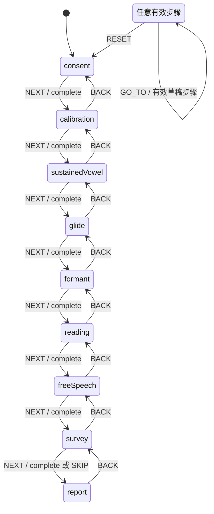

# 嗓音测试前端状态机

嗓音测试的步骤位置由 `src/voice-test/voiceTestMachine.js` 中的 XState actor 唯一管理。`VoiceTestWizard.jsx` 只渲染页面边界与布局；会话恢复、60 分钟到期、稿件、回放和视图模型由 `useVoiceTestWizard` 编排，上传与分析分别由 `useVoiceTestUpload` 和 `useVoiceAnalysis` 管理。

## 状态图

`NEXT` 必须携带 `complete: true`；未完成步骤不会转换。`GO_TO` 只接受 0–8，用于恢复有效草稿或返回待处理上传所在步骤。重新开始和会话到期都通过同一入口回到 `consent`。

## 边界职责

- `useVoiceTestUpload` 在请求 S3 地址前把原始 Blob 写入 IndexedDB。首次上传和重试共用同一函数，并以会话及录音对象身份拒绝迟到响应。
- `useVoiceAnalysis` 只提交一次分析任务；网络恢复和读取失败继续查询原任务，不重复消耗分析资源。
- `VoiceTestRecorderPane`、`VoiceTestSurveyPane`、`VoiceTestResultPane` 和 `VoiceTestProgress` 是展示组件，不拥有会话或网络副作用。
- `VOICE_TEST_STEPS` 是状态名、标题、说明和录音数量的唯一配置源。

## 可观测性

开发模式会启用 XState DevTools。每次实际步骤转换还会在 `window` 发布 `vfs:voice-test-transition` 事件，`detail` 只包含 `from`、`to` 和 `event`，不包含用户、会话或录音数据。端到端测试和本地诊断可以监听该事件确认关键路径。

项目继续使用 Amplify 兼容的 XState 4 核心。React 19 通过 `useSyncExternalStore` 订阅 actor，避免引入 peer 范围只覆盖 React 18 的旧 `@xstate/react` 绑定。

## 验证

- 状态图单元测试：`tests/unit/voice-test/voiceTestMachine.test.js`
- 进度语义测试：`tests/unit/components/VoiceTestProgress.test.jsx`
- 恢复、到期、跨步骤上传、重试、问卷和分析集成测试：`tests/integration/components/VoiceTestWizard.test.jsx`

修改步骤时必须先更新 `VOICE_TEST_STEPS` 与状态机转换，再同步更新状态图和相关测试。
